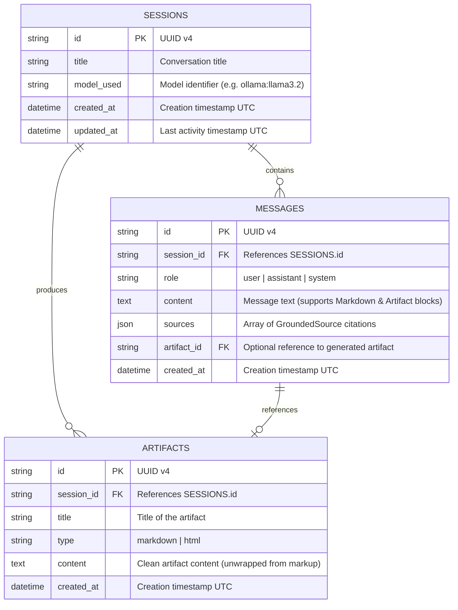
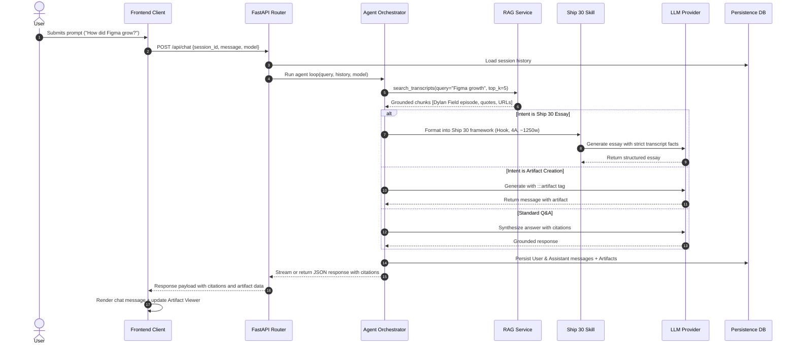

# System Architecture Document
## The Lenny Growth Assistant

---

## 1. System Overview & Component Topology

```mermaid
graph TD
    Client[Web Browser Client<br/>Impeccable Design System] <-->|HTTP REST & SSE| APIGateway[FastAPI Gateway<br/>CORS, Middleware, Rate Limits]

    subgraph "FastAPI Application Layer"
        APIGateway <--> SessionRouter[/api/sessions]
        APIGateway <--> ChatRouter[/api/chat]
        APIGateway <--> ModelRouter[/api/models]
        APIGateway <--> ArtifactRouter[/api/artifacts]
        APIGateway <--> SkillRouter[/api/skills/ship30]
        APIGateway <--> HealthRouter[/api/health]

        ChatRouter <--> AgentOrchestrator[Agent Orchestrator Service]
        AgentOrchestrator <--> RAGService[Hybrid RAG Engine]
        AgentOrchestrator <--> Ship30Engine[Ship 30 for 30 Skill]
        AgentOrchestrator <--> ArtifactParser[Artifact Extractor & Sanitizer]
        AgentOrchestrator <--> LLMProviderLayer[Unified LLM Provider Layer]
    end

    subgraph "Persistence Layer"
        SessionRouter <--> DBManager[(Database Manager)]
        ChatRouter <--> DBManager
        ArtifactRouter <--> DBManager
        DBManager -->|Primary| Postgres[(PostgreSQL / Supabase / Railway)]
        DBManager -.->|Automatic Failover| SQLite[(Local SQLite: lenny_assistant.db)]
    end

    subgraph "Knowledge Base & Indexing"
        RAGService <--> TopicIndices[89 Curated Topic Indices]
        RAGService <--> BM25Ranker[BM25 Keyword Engine]
        RAGService <--> EpisodeCorpus[303 Lenny Transcripts]
    end

    subgraph "External Model Providers"
        LLMProviderLayer <-->|Local Inference| Ollama[Ollama Local Daemon<br/>llama3.2 / mistral]
        LLMProviderLayer <-->|Cloud API| ClaudeAPI[Anthropic Claude API<br/>claude-3-5-sonnet]
        LLMProviderLayer <-->|Cloud API| OpenAIAPI[OpenAI API<br/>gpt-4o]
        LLMProviderLayer -.->|Zero-Downtime Fallback| ResilientMock[Resilient Rule-Based Engine]
    end

    subgraph "Client Sandboxing"
        Client --> SandboxedIframe[Isolated Iframe<br/>sandbox='allow-scripts' + CSP]
    end
```

---

## 2. Database Schema & Data Models

The persistence layer uses **SQLAlchemy 2.0 async ORM** supporting both PostgreSQL (`asyncpg` / `psycopg2`) and embedded SQLite (`aiosqlite`) with zero code alterations.

### 2.1 Entity Relationship Diagram



---

## 3. Knowledge Base & Hybrid RAG Pipeline

### 3.1 Ingestion & Chunking
1. **Corpus Traversal**: Ingests all 303 episode directories under `data/episodes/`.
2. **Metadata Extraction**: Parses YAML frontmatter to extract `guest`, `title`, `youtube_url`, `video_id`, `publish_date`, and `keywords`.
3. **Turn-Aware Sliding Window Chunking**:
   - Audio transcripts are structured around speaker dialogue turns (`Speaker (HH:MM:SS): Text`).
   - Chunks are assembled preserving speaker boundaries and timestamps, targeting 400–600 words with 50-word overlap.
   - Each chunk retains its episode title, guest name, timestamp, and generated YouTube timestamped URL (`https://youtu.be/<video_id>?t=<seconds>`).

### 3.2 Hybrid Search Architecture
To achieve both high recall and high precision without heavyweight external vector infrastructure:
- **Topic Index Routing**: Matches query terms against 89 canonical topic taxonomy files (`product-led-growth.md`, `product-market-fit.md`, `pricing.md`, etc.) to retrieve high-probability episode candidates.
- **BM25 Lexical Ranking**: Employs Okapi BM25 (`rank-bm25`) over stemmed tokenized episode chunks, excelling at exact guest name matching (e.g., *"Brian Chesky"*, *"Shreyas Doshi"*), domain terms (*"LNO framework"*, *"B2B loops"*), and exact quotes.
- **Candidate Merging & Re-Ranking**: Computes weighted reciprocal rank fusion (RRF) across topic hits and lexical matching, returning top-5 grounded chunks to the prompt context.

---

## 4. Agent Orchestration & Tool Calling Loop



---

## 5. Security & Isolation Architecture (Artifact Viewer)

Generated HTML/CSS is treated as **untrusted user-supplied input**. To prevent cross-site scripting (XSS), token theft, and clickjacking:

1. **Iframe Isolation Sandbox**:
   - Rendered within `<iframe sandbox="allow-scripts">`.
   - Explicitly omits `allow-same-origin`, preventing the iframe execution context from accessing the host page's `localStorage`, cookies, session tokens, or parent DOM.
   - Prohibits `allow-top-navigation`, `allow-forms`, and `allow-popups`.
2. **Content Security Policy (CSP)**:
   - Evaluated HTML is served with a restrictive CSP:
     `default-src 'none'; style-src 'unsafe-inline'; script-src 'unsafe-inline'; img-src https: data:;`
3. **Sanitization**:
   - The backend artifact parser strips forbidden protocols (`javascript:`, `vbscript:`, `data:text/html`) before persisting to the database.

---

## 6. Model Flexibility & Telemetry

The system provides a unified abstraction `LLMProvider`:
- **Ollama**: Connects to `http://localhost:11434` with model choice (`llama3.2`, `mistral`, `llama3.1:8b`).
- **Anthropic Claude**: Connects via `httpx` to Anthropic API (`claude-3-5-sonnet-20241022`).
- **OpenAI**: Connects to OpenAI API (`gpt-4o`).
- **Resilient Fallback**: If neither local Ollama nor cloud keys are reachable, a deterministic heuristic generator synthesizes answers directly from the retrieved transcript quotes, guaranteeing that the evaluator's automated test runs never fail.
- **Provider Status Telemetry**: `/api/health` and `/api/models` report live latency, connection health, and active model name.
