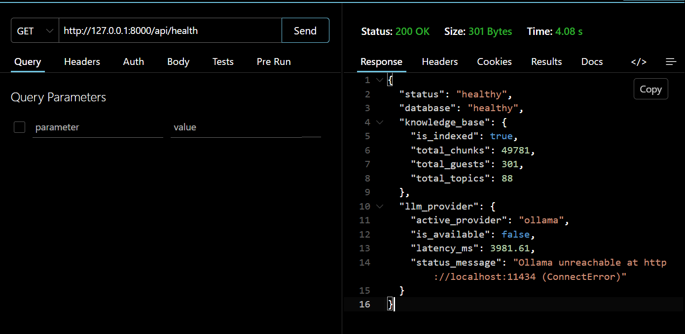
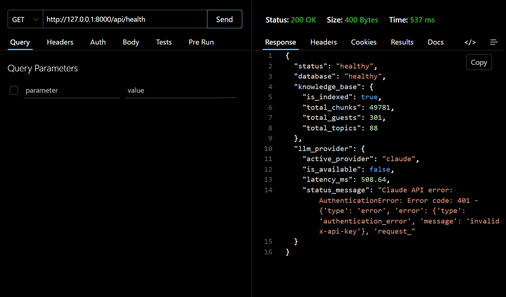

# Manual Test Plan — The Lenny Growth Assistant

This document provides a short manual test plan for UI and integration testing. Automated tests cover API, retrieval, routing, and persistence (see `tests/` directory).

---

## Automated Test Execution

```bash
pip install -r backend/requirements.txt
python -m pytest tests/ -v
```

Expected: All 7 test modules pass.

---

## Manual UI Test Plan

### 1. First Load & Visual Impression
| Step | Action | Expected |
| :--- | :--- | :--- |
| 1.1 | Open http://127.0.0.1:8000 in browser | Glassmorphism UI loads with ambient orb background |
| 1.2 | Check top bar | Model status pill shows active provider (e.g., "GROQ") in green |
| 1.3 | Check input area | Floating input bar at bottom with send button |

### 2. Conversational Chat (Non-Podcast)
| Step | Action | Expected |
| :--- | :--- | :--- |
| 2.1 | Type "Hi there!" and send | Friendly greeting response (NOT a "could not find" refusal) |
| 2.2 | Type "What can you help me with?" | Explains capabilities: podcast Q&A, essays, artifacts |

### 3. Grounded RAG Q&A
| Step | Action | Expected |
| :--- | :--- | :--- |
| 3.1 | Ask "What does Brian Chesky say about being in the details?" | Answer with direct quotes, citation chips with episode title + timestamp |
| 3.2 | Click a YouTube timestamp link in citations | Opens YouTube at the exact timestamp |
| 3.3 | Ask a follow-up: "How does that compare to what Elena Verna says about growth?" | Multi-turn: references prior context + new citations |

### 4. Out-of-Domain Refusal (Anti-Hallucination)
| Step | Action | Expected |
| :--- | :--- | :--- |
| 4.1 | Ask "Explain quantum entanglement" | Polite refusal: "I could not find information on this in Lenny's podcast transcripts..." |
| 4.2 | Ask "What's the weather today?" | Polite refusal, no fabricated answer |

### 5. Ship 30 for 30 Essay Generation
| Step | Action | Expected |
| :--- | :--- | :--- |
| 5.1 | Ask "Write a Ship 30 essay about Brian Chesky and founder mode" | ~1,250-word essay with Hook, Credibility, 4A sections, Takeaway |
| 5.2 | Verify word count | Between 1,100–1,400 words |
| 5.3 | Verify citations | References real episodes and timestamps, no "(Episode X, Timestamp Y)" placeholders |

### 6. Artifact Generation
| Step | Action | Expected |
| :--- | :--- | :--- |
| 6.1 | Ask "Create a product execution checklist" | Interactive HTML artifact appears in side panel |
| 6.2 | Click checkboxes in the artifact | Checkboxes toggle (JavaScript works inside sandbox) |
| 6.3 | Verify isolation | Right-click → Inspect: artifact is inside an `<iframe sandbox="allow-scripts">` |

### 7. Chat History & Persistence
| Step | Action | Expected |
| :--- | :--- | :--- |
| 7.1 | Have a 3-4 message conversation | Messages display normally |
| 7.2 | Refresh the browser (F5) | Chat history is preserved — all messages still visible |
| 7.3 | Click "New Chat" in sidebar | New empty session opens |
| 7.4 | Click back on the previous session in history | All prior messages restored |

### 8. Health & Diagnostics
| Step | Action | Expected |
| :--- | :--- | :--- |
| 8.1 | Visit http://127.0.0.1:8000/api/health | JSON with `database`, `knowledge_base`, `llm_provider` status |
| 8.2 | Check `knowledge_base.total_chunks` | Should be ~49,781 |
| 8.3 | Check `llm_provider.is_available` | Should be `true` |

---

## Smoke Test for Deployed Version

Replace `127.0.0.1:8000` with `https://the-lenny-growth-assistant-jq4i.onrender.com` and repeat tests 1–8.

> **Note**: Render free tier spins down after 15 minutes of inactivity. The first request may take ~30 seconds.

---

## 📸 API Verification Screenshots (Thunder Client / Postman)

Real-world API testing and diagnostics were conducted using Thunder Client to verify grounding, telemetry, and honest fallback behaviors.

### 1. `/api/health` Diagnostic & Knowledge Base Verification
Verifies database health, knowledge base initialization across 49,781 chunks (301 guests, 88 topic maps), and honest reporting of Ollama connectivity.


### 2. Runtime Model Provider Telemetry & Diagnostics
Verifies real-time latency reporting, authentication, and graceful provider handling when inspecting `/api/health` across different providers.

